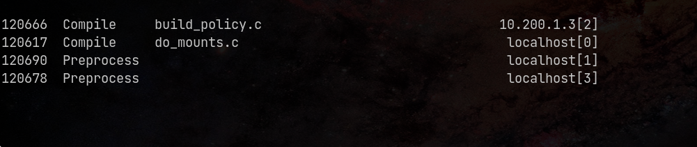

> Это репозиторий к публикации в блоге про распределенную компиляцию. 
> Подробный разбор происходящего можно найти по [ссылке](https://rustbas.github.io/blog/linux/distrant/).

# Описание

Здесь мы хотим посмотреть на возможность компиляции ядра Linux (минимальной
конфигурации `tinyconfig`) на двух виртуальных машинах с разными 
характеристиками. Но для этого нужно рассказать про утилиту `vagrant`,
конфигуратор виртуальных машин.

## Vagrant

Vagrant[^1] (с англ. — «бродяга») — свободное и открытое программное
обеспечение для создания и конфигурирования виртуальной среды разработки.
Является обёрткой для программного обеспечения виртуализации, например
VirtualBox, и средств управления конфигурациями, таких как Chef, Salt и 
Puppet

Данная утилита полезна тем, что позволяет, используя шаблоны виртуальных
машин, запускать их. Для описания стэка требуется один т.н. Vagrantfile. 
Она может работать совместно с qemu, VirtualBox, VMWare и пр. 

О vagrant стоит знать потому, что в какой момент, эксперементируя с 
виртуальными машинами, надоест каждый раз их устанавливать в условном VMWare.

## Distcc

distcc[^2] (от англ. distributed C/C++/ObjC compiler) — инструмент, 
позволяющий компилировать исходные коды при помощи 
компиляторов C/C++/ObjC на удалённых машинах, что ускоряет процесс компиляции.

Важно понимать, что это своего рода фронтенд для компиляторов, 
сам по себе он не компилирует код.

# Запуск

Для начала запустим стенд командой `vagrant up`. На моем ноутбуке это занимает 
примерно 127 секунд.

Далее необходимо подключиться к главной машине и распаковать исходники ядра[^3]:

```sh
vagrant ssh master
tar xvf linux-6.13.tar.gz
cd linux-6.13
```

Создаем файл минимальной конфигурации 
(с остальными вариантам можно ознакомиться командой `make help | less`):

```sh
make tinyconfig
```
  
Для запуска распределенной компиляции, нужно сначала запустить демон на
второй виртуальной машине. Для этого подключаемся к ней и запускаем его:

```sh
vagrant ssh slave-1
distccd --daemon --allow-private
```

Параметр `--allow-private` разрешает стучаться только с приватных сетей.

Для проверки можно:

1. На второй машине проверить открытые порты: `ss -ntlp | grep 3632`,
2. На основной машине постучаться в этот порт: `telnet 10.200.1.3 3632` 
   (выход на `C-] C-d`).

Теперь нужно добавить хост, чтобы на нем можно было удаленно компилировать. 
Для этого на основной машине:

```sh
export DISTCC_HOSTS="localhost 10.200.1.3"
```

Для проверки можно посмотреть список хостов для компиляции: `distcc --show-hosts`.

Запустим компиляцию на 5 потоках с замером времени:

```sh
time -p make -j5 CC="distcc gcc"
```

Мониторить компиляцию можно с помощью команды (на основной машине):

```sh
watch -n 1 distccmon-text
```



[^1]: Википедия [Vagrant](https://ru.wikipedia.org/wiki/Vagrant).
[^2]: Википедия [distcc](https://ru.wikipedia.org/wiki/Distcc).
[^3]: Исходный код ядра можно найти [здесь](https://cdn.kernel.org/pub/linux/kernel/v6.x/linux-6.13.tar.gz).
