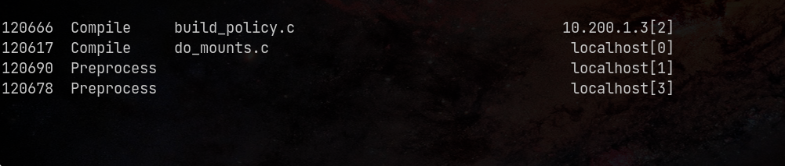

# Disgrant

Это репозиторий к публикации в блоге про распределенную компиляцию. 
Подробный разбор происходящего можно найти по [ссылке](https://saccada.xyz/linux/distrant/).

> [!IMPORTANT]
> Это обновленная версия, в которой в качестве провизора используется `ansible`.
> Чтобы посмотреть, как репозиторий выглядел до этого, можно переключиться на
> тег **blog-path**.

## Описание

Здесь мы хотим посмотреть на возможность компиляции ядра Linux (минимальной
конфигурации `tinyconfig`) на нескольких виртуальных машинах с разными 
характеристиками. Но для этого нужно рассказать про утилиту `vagrant`,
конфигуратор виртуальных машин.

### Vagrant

Vagrant[^1] (с англ. — «бродяга») — свободное и открытое программное
обеспечение для создания и конфигурирования виртуальной среды разработки.
Является обёрткой для программного обеспечения виртуализации, например
VirtualBox, и средств управления конфигурациями, таких как Chef, Salt и 
Puppet

Данная утилита полезна тем, что позволяет, используя шаблоны виртуальных
машин, запускать их. Для описания стэка требуется один т.н. Vagrantfile. 
Она может работать совместно с qemu, VirtualBox, VMWare и пр. 

О vagrant стоит знать потому, что в какой момент, эксперементируя с 
виртуальными машинами, надоест каждый раз их устанавливать в условном VMWare.

### Ansible

Для установки утилит внутри виртуальных машин используется `ansible`.
Описание требований лежит в файле `provisioning/playbook.yaml`. Он
содержит в себе этапы:
1. Обновление `apt`.
2. Установка необходимых пакетов.
3. Копирование и распаковка кодовой базы ядра.
4. Создание конфига для ядра.
5. Запуск демона `distccd`.

### Distcc

distcc[^2] (от англ. distributed C/C++/ObjC compiler) — инструмент, 
позволяющий компилировать исходные коды при помощи 
компиляторов C/C++/ObjC на удалённых машинах, что ускоряет процесс компиляции.

Важно понимать, что это своего рода фронтенд для компиляторов, 
сам по себе он не компилирует код.

## Запуск

### Исходные данные

Для того, чтобы запустить процесс, необходимо:

1. Скачать **box** `debian.bookworm.libvirt.box` с оф. сайта HashiCorp
   (недоступен в РФ). У меня используется версия с `libvirt`.
2. Скачать исходный код ядра:
   ```console
   foo@bar:~/disgrant$ wget -P provisioning/ https://cdn.kernel.org/pub/linux/kernel/v6.x/linux-6.13.tar.gz
   ```

### Воспроизведение

Для начала запустим стенд командой `vagrant up`.

Далее необходимо подключиться к первой ноде и проверить
настройки `distcc`:

```console
foo@bar:~/distgran$ vagrant ssh node-1
vagrant@node-1:~$ cd linux-6.13
vagrant@node-1:~/linux-6.13$ distcc --show-hosts
```

Далее запустим `tmux`, чтобы было удобнее работать с терминалом внутри
машины:

```console
vagrant@node-1:~/linux-6.13$ tmux
```

Для создания новой вкладки – `Ctrl-B C`, для переключения – `Ctrl-B N`, 
где `N` – номер вкладки.

На первом окне запустим бенчмарк `hyperfine`:

```sh
hyperfine --warmup 1                    \
          --runs 3                      \
          --prepare 'make clean'        \
          --parameter-scan jobs 1 4     \
          --export-markdown ~/result.md \
          'make -j {jobs} CC="distcc gcc"'
```

Это запустит бенчмарк, в котором:
1. Будет один разогревочный (для кеша операционной системы) запуск.
2. Для оценки времени будет выполнено по 3 запуска.
3. Перед каждым запуском будет выполнена команда `make clean` (которая удалит
   все собранные файлы).
4. Будет сравнено 4 команды – компиляция с использованием от 1 до 4 потоков
   (параметр `jobs` в команде).
5. Результат будет выведен в виде markdown-таблицы в файл `~/result.md`. Чтобы
   сохранить его локально, самый простой способ – вывести на экран и перевести
   поток вывода в файл: `vagrant ssh node-1 -c 'cat result.md' > result.md `.

Мониторить компиляцию можно с помощью команды (в соседней вкладке tmux):

```sh
watch -n 1 distccmon-text
```



У меня получился следующий результат:

| Command | Mean [s] | Min [s] | Max [s] | Relative |
|:---|---:|---:|---:|---:|
| `make -j 1 CC="distcc gcc"` | 184.960 ± 5.444 | 178.855 | 189.312 | 1.84 ± 0.06 |
| `make -j 2 CC="distcc gcc"` | 128.249 ± 5.975 | 123.301 | 134.887 | 1.27 ± 0.06 |
| `make -j 3 CC="distcc gcc"` | 102.266 ± 4.985 | 96.514 | 105.317 | 1.02 ± 0.05 |
| `make -j 4 CC="distcc gcc"` | 100.749 ± 1.812 | 99.007 | 102.623 | 1.00 |

[^1]: Википедия [Vagrant](https://ru.wikipedia.org/wiki/Vagrant).
[^2]: Википедия [distcc](https://ru.wikipedia.org/wiki/Distcc).
[^3]: Исходный код ядра можно найти [здесь](https://cdn.kernel.org/pub/linux/kernel/v6.x/linux-6.13.tar.gz).
